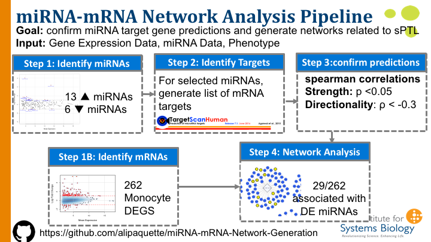

# miRNA-mRNA-Network-Generation

The **goal** of the code reflected here was to confirm miRNA-mRNA networks predicted by targetscan and relate them to phenotypes of interest.  These networks can be visualized within **cytoscape**. (Shannon et al, Genome Research, 2003)

**Input Required:**
  *1.* High throughput RNA sequencing results: mRNA
  *2.* High throughput small RNA sequencing results (single end)
  *3.* Some sort of list of DE miRNAs & mRNAs of interest generated through EdgeR, DESeq2, or your method of choice
  
**Dependencies:** Stats(base)

**Note:** At the current time all miRNA .txt files need to be manually downloaded from http://www.targetscan.org/vert_71/.  These raw files will be manually read into R with the code as it is.  Due to issues w/ the naming of IDs and miRNA alignment methods, I cannot at this stime automate this step :(
